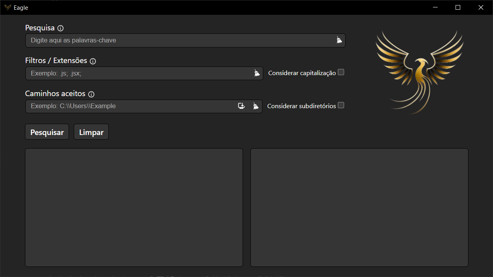

# Eagle

This C++/React application allows you to search for specific words within text files.

## 🚀 Features
- **Word Search:** Search for a word or character sequence within text files.
- **Results Display:** Displays in which files and on which lines the word was found.
- **Search Customization:** Options to customize the search, such as case sensitivity.

## 🌟 Usage

- Fill in the fields as needed
- Use the **Search** button to start the search
- In the results list, select one of the results to see which line contains the searched keyword

## 🤝 Contribution
Contributions are welcome! If you have suggestions, improvements, or corrections, feel free to open an issue or a pull request.

## 📄 License
This project is licensed under the [License](License). See the LICENSE file for more details.

Enjoy!